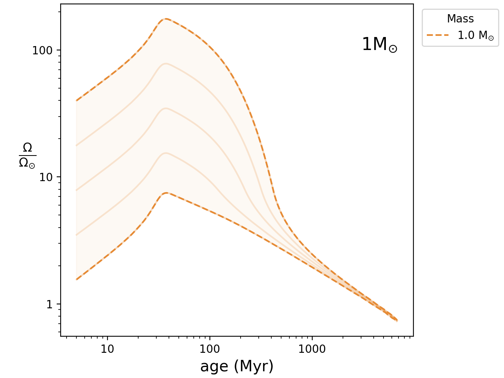
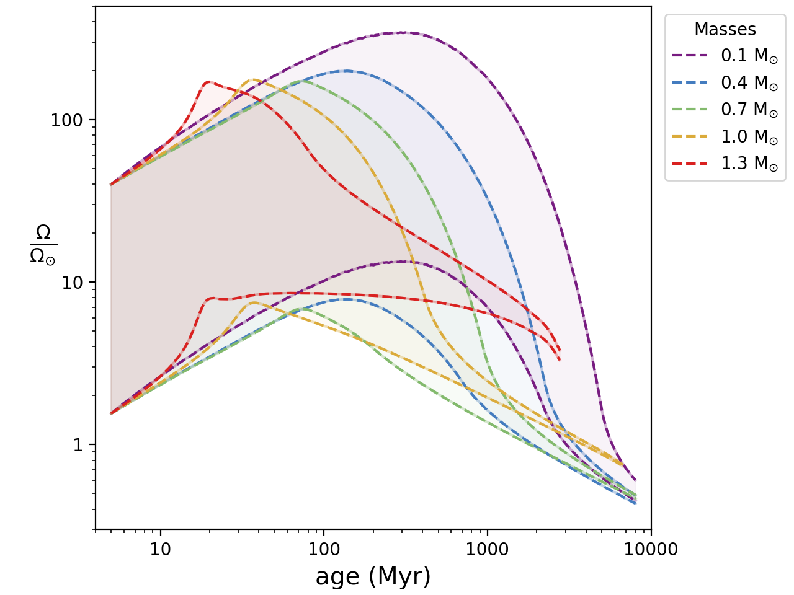
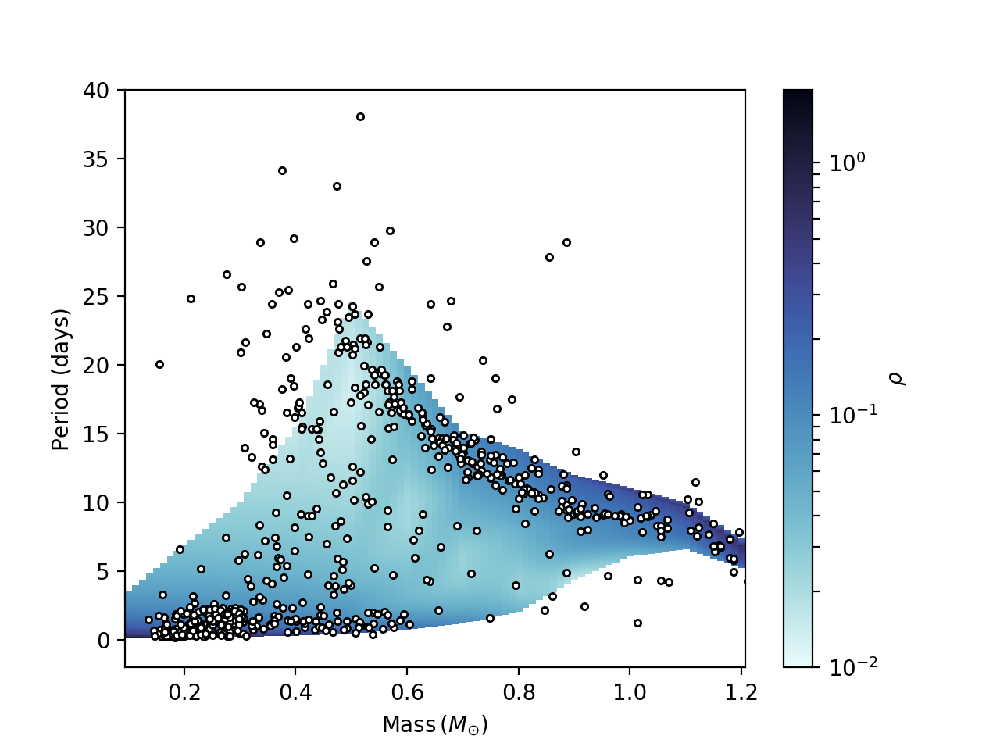
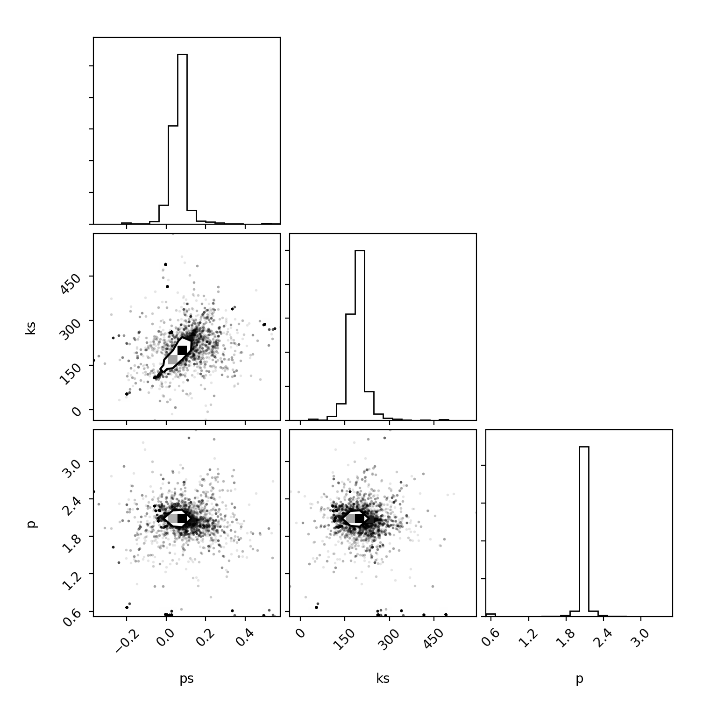

# sample_codes

A sample of coding work done during my PhD, which was on statistical fitting of stellar rotation evolution models. (Note: plotting is done in other routines). Physical models that optimally fit rotation data allow for the more robust use of the gyrochronology technique (whereby a star's age can be inferred from its mass and rotation rate), and also give us a greater insight into the magnetised stellar wind physics (which govern the rotational evolution) of these stars. More details can be found in Breimann 2021, accessible [here](https://ui.adsabs.harvard.edu/abs/2021ApJ...913...75B/abstract). 

**calc_sb_evol.py:**
---
Given an initial age, mass and angular velocity, the code can evolve a single star's rotation rate forwards in time. The following Figure shows the rotational evolution of five stars, all solar mass but initialised at different rotation rates. The fastest and slowest stars are depicted with dashed lines.  The rotation rates converge with time. 

   

Similarly, the convergence of rotation rates depends on mass:

   

The code can also evolve entire clusters of stars (consisting of a range of initial rotation rates and stellar masses) forwards in time, to some desired final age. The resulting evolved cluster can be plotted on a rotation-period vs mass diagram (PMD) to show a distribution of rotation rates for a group of coeval stars. This distribution can then be expressed as a probability density on the PMD using either brute force (see Breimann et al 2021) or deterministic methods (see Breimann et al 2022 in prep). Such a distribution is shown below, where a uniform distribution of model stars has been evolved to the age of the Praesepe cluster, shown as white points. 

   

This code has been used in research in conjunction with other codes to explore parameter space of convective turnover times and torque laws (both of which alter the rotational evolution and hence the distribution of the model on the PMD and how well it fits to observed data). 

**MCMC_17_params.py:**
---
This research code is used in combination with calc_sb_evol.py. It generates random parameters with which the rotational evolution models are generated, and then assesses the goodness of fit of the resulting model using the tau squared statistic. This statistic assesses the fit in two dimensions (rotation period and mass). An example of the resulting parameter space explored (varying only 3 parameters in the model) is shown in the corner plot below, which shows the correlations between each of the parameters and a 1d histogram of the samples drawn from the probability distribution. 

   

The code can also vary 17 more parameters at once. Results for this have not yet been published - stay tuned! 

